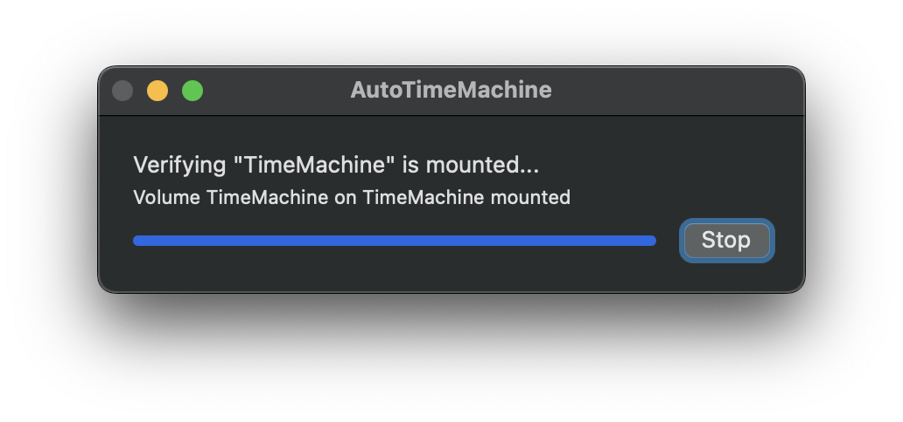
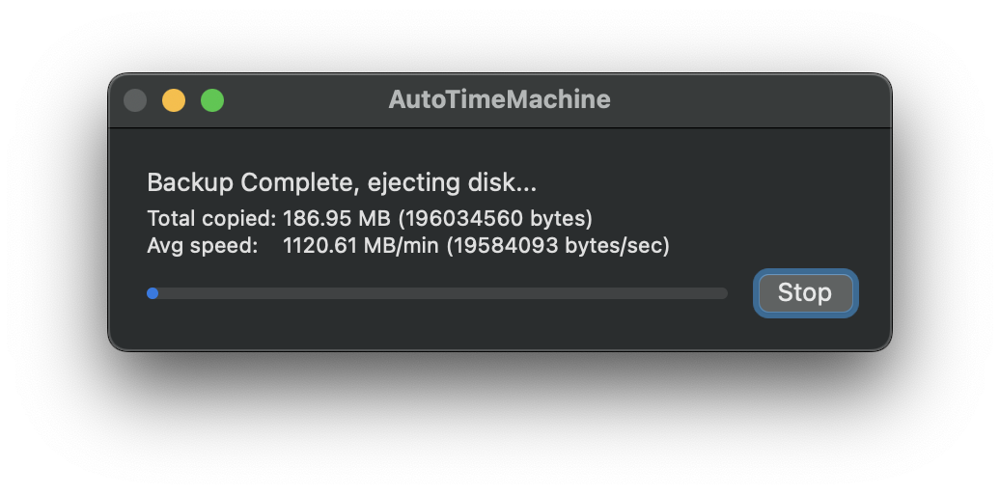

## AutoTimeMachine

### What is this?
This script is meant to do something simple, mount a TimeMachine backup, run a backup, and then eject the TimeMachine disk. 

### But why?
You may have a personal computer, and a work computer, but use the same equipment on both.  This would allow both a TimeMachine backup to happen, and for the device to be unmounted when it is time to disconnect the current machine from the dock/hub/etc
### How do I get this running?
Like all AppleScripts being shared, only a text version of it can be shared, as a compiled application would need to be signed.
1. Download AutoTimeMachine.applescript
2. Open this in Script Editor.
3. Press Command K, to compile the script.
4. File > Export...
   * File Format: "Application"
   * Code Sign: "Sign to run Locally"
5. Save this somewhere, Application folder is most appropriate

Once this is saved out, you can double click on it.
### What is it doing?
The script uses `tmutil` via command line, to pull out some information.  The first things we need to know is the TimeMachine volume name, and the Backup Destination ID
`tmutil destinationinfo`
Once we have this information, we can ask `diskutil` to mount the volume, by name.  
`diskutil mount VolumeName`
When the volume mounts, we run a TimeMachine back to it, using `tmutil`
`tmutil startbackup --block --destination <DestinationID>`
* This may take sometime to complete, so be patient.
Once the backup is complete, we eject the disk:
`diskutil eject VolumeName`
At this point, we are done.

### About
The script uses progress bars as its UI, which is not the best approach, but its functional enough to get through this, without having to write more code.

When launched, the first screen you will see is:

Once a backup starts, we see:

Once this is completed, we see the following summary:

I hope this can be collaborative project, so other options that you use can be added.

-MikeW
